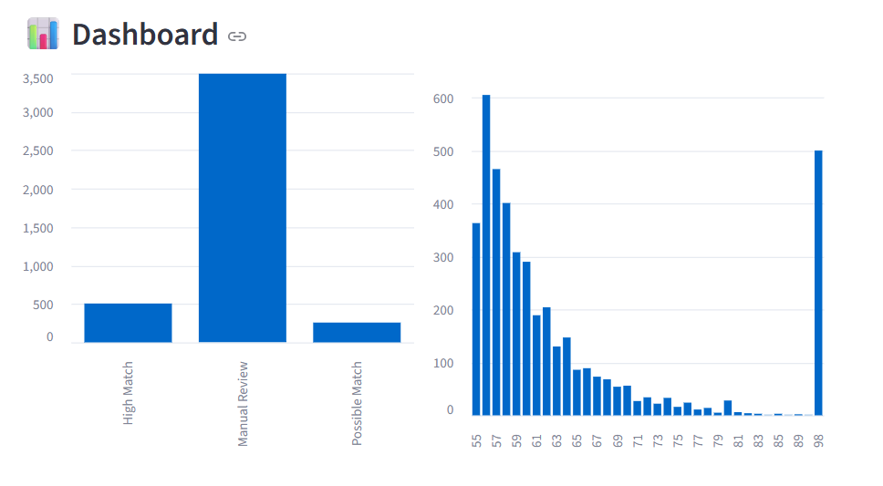
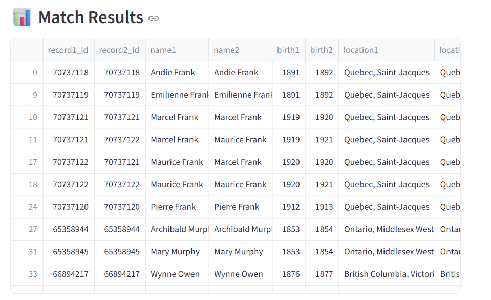
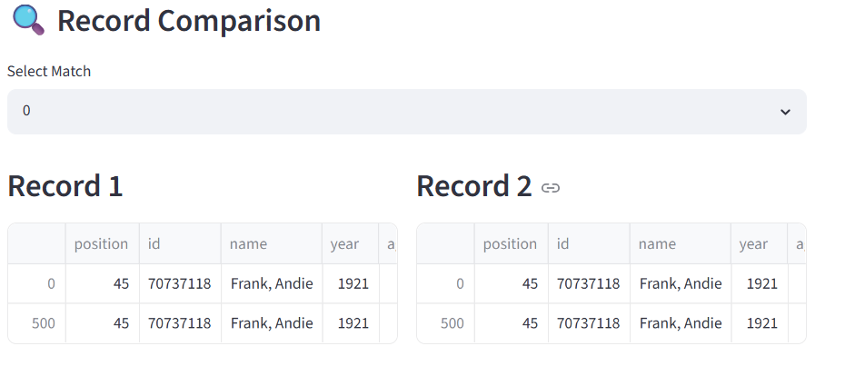
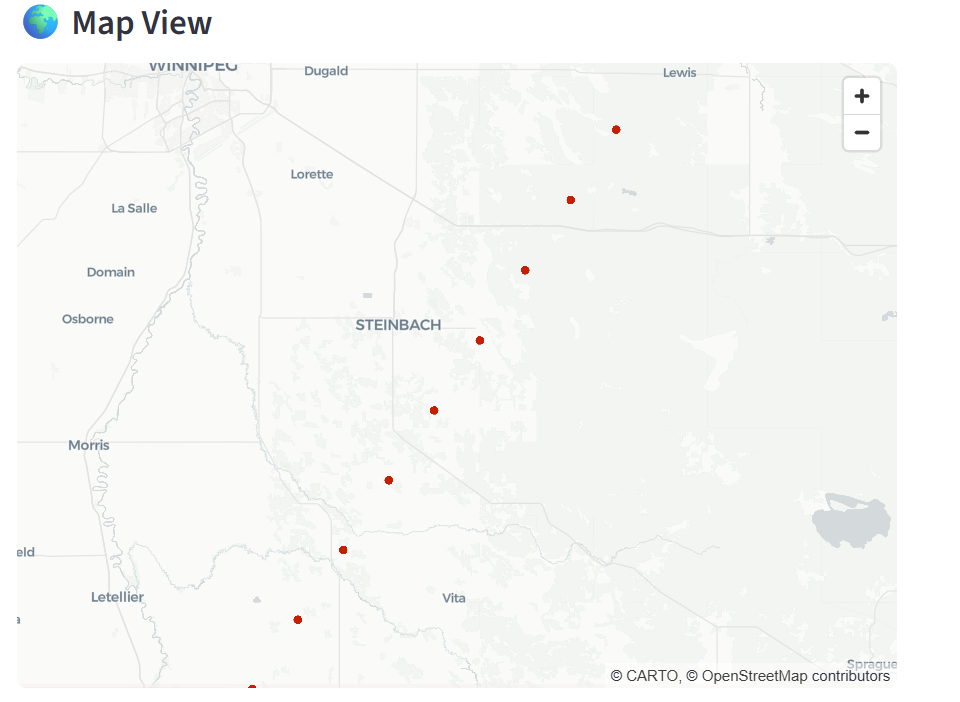

# Arctic Record Reconciliation System

## 🚀 Live Application
[View the Dashboard](https://arctic-record-reconciliation.streamlit.app/)

---

## 📌 Project Overview
The **Arctic Record Reconciliation System** is an end-to-end data pipeline and investigation platform designed to identify duplicate or related records across heterogeneous datasets. This system is engineered to solve the complex challenge of entity resolution by linking census and parish records, evaluating data quality, and automating the prioritization of cases requiring manual human intervention.

This project bridges the gap between raw data processing and actionable decision-making, providing analysts with an interactive interface to audit data integrity and resolve record discrepancies efficiently.

---

## 📸 System Interface

| Dashboard Overview | Match Results Analysis |
| :---: | :---: |
|  |  |
| **Comparison View** | **Geospatial Analysis** |
|  |  |

---

## 🧠 Technical Methodology
The system employs a multi-staged record linkage pipeline to ensure high precision in data matching:

*   **Probabilistic Matching:** Utilizes `RapidFuzz` for high-performance fuzzy name matching, complemented by birth year and community location similarity heuristics.
*   **Intelligent Scoring:** Each potential match is assigned a confidence score and automatically classified into decision-tiers:
    *   ✅ **High Confidence**: Automatic linkage.
    *   ⚠️ **Potential Match**: Flagged for supplementary verification.
    *   🔴 **Manual Review Required**: Discrepancies prioritized for expert investigation.
*   **Data Health Assessment:** Integrated diagnostic modules evaluate records for completeness, null-value density, and structural consistency.

---

## 🚀 Core Functionalities
*   **Intelligent Entity Resolution:** Multi-source fuzzy matching for record linkage.
*   **Interactive Analytics Dashboard:** Real-time visualization of match confidence levels and data quality metrics.
*   **Investigation Workflow:** Streamlined side-by-side comparison view to facilitate faster manual resolution.
*   **Geospatial Intelligence:** Integrated mapping visualization for location-based record validation.
*   **Data Stewardship:** Built-in exports for cleaned datasets and investigative findings.

---

## 🛠️ Tech Stack
*   **Data Processing:** Python, Pandas
*   **Framework:** Streamlit
*   **Linkage Engine:** RapidFuzz (Levenshtein distance/fuzzy logic)
*   **Visualization:** Interactive metrics and mapping libraries

---

## ▶️ Local Deployment
1. Clone the repository:
```bash
   git clone [https://github.com/Godsbrain/Arctic_Record_Reconciliation.git](https://github.com/Godsbrain/Arctic_Record_Reconciliation.git)
   cd Arctic_Record_Reconciliation
